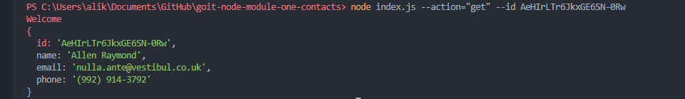
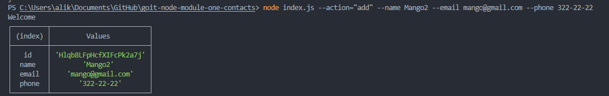
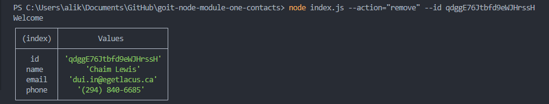

## Отримуємо і виводимо весь список контактів у вигляді таблиці (console.table)

`node index.js --action="list"`

## Отримуємо контакт по id

`node index.js --action="get" --id AeHIrLTr6JkxGE6SN-0Rw`

## Додаємо контакт

`node index.js --action="add" --name Mango2 --email mango@gmail.com --phone 322-22-22`

## Видаляємо контакт

`node index.js --action="remove" --id qdggE76Jtbfd9eWJHrssH`

